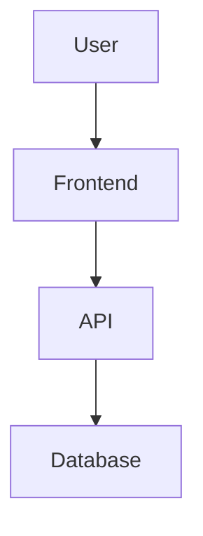

# Documentation Refactor

Refactor project documentation structure adapted to project type:

## 1. Analyze Project

Identify:
- Project type: library, API, web app, CLI, microservices
- Architecture and main components
- User personas: developers, end-users, operators
- Existing documentation state

## 2. Centralize Documentation

Move technical documentation to `docs/` with proper cross-references:
- Consolidate scattered `.md` files
- Remove duplicate content
- Fix broken links
- Update outdated information

## 3. Root README.md

Streamline as entry point with:
- Project overview (1-2 paragraphs)
- Quick start guide (< 5 minutes to first success)
- Modules/components summary with links
- Badges (build status, coverage, version)
- License and contacts

## 4. Component Documentation

Add module/package/service-level README files:
- Purpose and responsibility
- Setup instructions
- Configuration options
- Testing instructions
- API reference (if applicable)

## 5. Organize `docs/` Directory

Structure by relevant categories:

```
docs/
├── architecture/     # System design, diagrams
├── api/              # API reference, endpoints
├── guides/           # How-to guides
│   ├── getting-started.md
│   ├── development.md
│   └── deployment.md
├── reference/        # Technical reference
├── troubleshooting/  # Common issues, FAQ
└── contributing.md   # Contribution guidelines
```

Adapt structure to project needs.

## 6. Create Guides (Select Applicable)

### User Guide
- End-user documentation for applications
- Feature walkthroughs
- UI/UX explanations

### API Documentation
- Endpoints with examples
- Authentication methods
- Error codes and handling
- Rate limits

### Development Guide
- Local setup
- Testing workflow
- Code style and conventions
- PR process

### Deployment Guide
- Environment requirements
- Configuration management
- Monitoring and logging
- Scaling considerations

## 7. Use Mermaid for Diagrams

Create visual documentation:
- Architecture diagrams
- Data flow diagrams
- State machines
- Entity relationships
- Sequence diagrams



## Guidelines

- Keep docs concise and scannable
- Use consistent formatting
- Include code examples
- Add table of contents for long docs
- Date and version significant docs
- Contextual to project type
