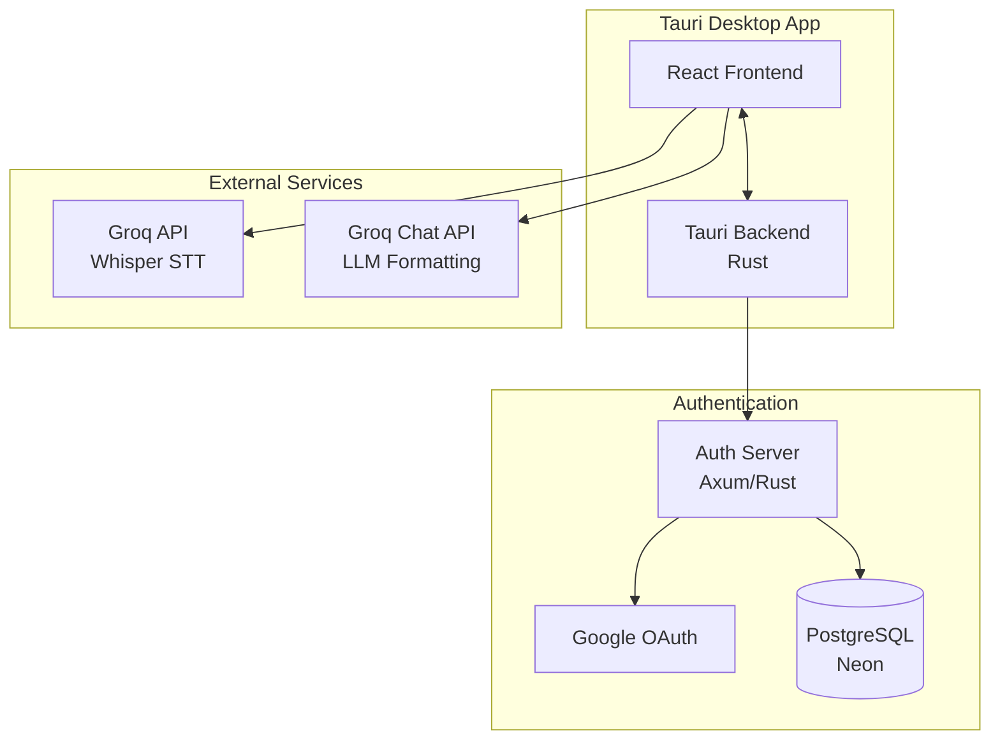
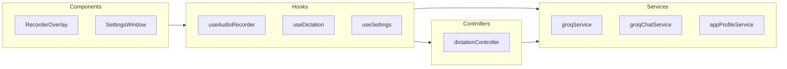
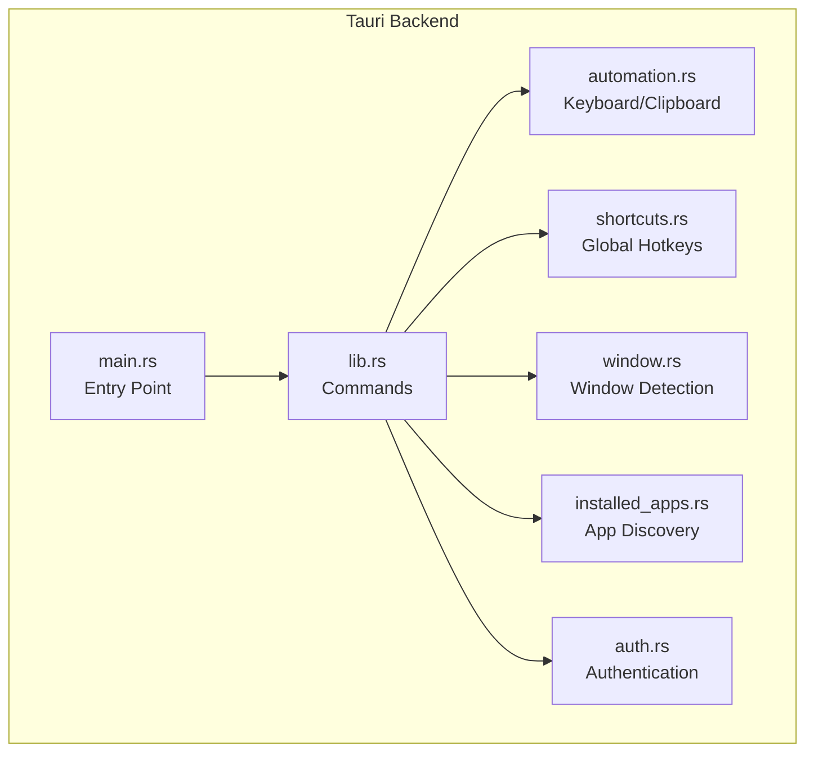
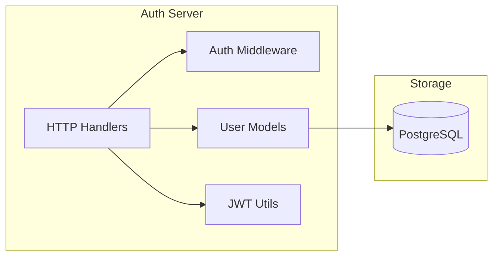
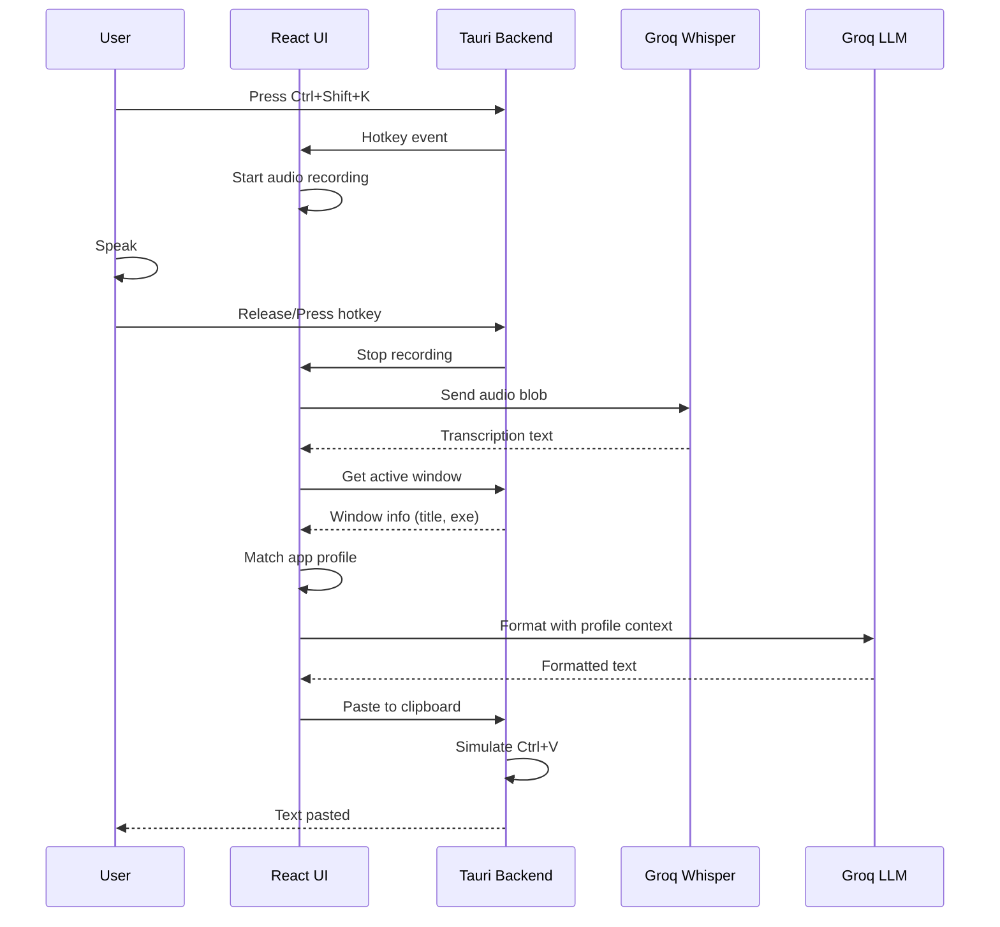
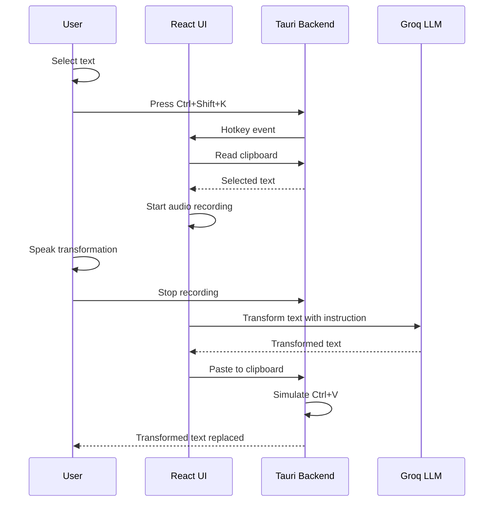
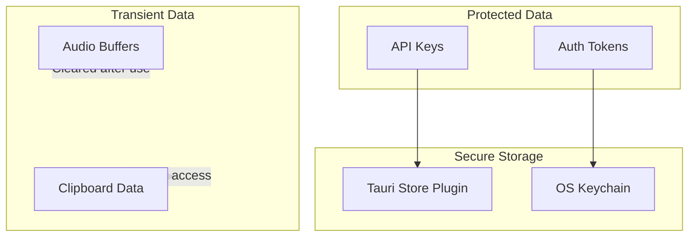

# Trueears Architecture Overview

This document deTrueearss the high-level architecture of Trueears, a context-aware AI voice dictation application.

## System Architecture

## Component Overview

### 1. Frontend (React + TypeScript)

The frontend handles the user interface and orchestrates the dictation workflow.

**Key Responsibilities:**
- Audio recording via Web Audio API
- Speech-to-text transcription via Groq Whisper
- LLM post-processing for context-aware formatting
- Settings management and persistence
- UI rendering for overlay and settings windows

### 2. Backend (Tauri/Rust)

The Rust backend provides platform-native capabilities.

**Key Responsibilities:**
- Global hotkey registration (`Ctrl+Shift+K`, `Ctrl+Shift+S`)
- Active window detection (Win32 APIs)
- Clipboard management (read/write)
- Keyboard simulation for auto-paste
- System tray integration

### 3. Auth Server (Axum/Rust)

Standalone authentication service for Google OAuth.

**Key Responsibilities:**
- Google OAuth code exchange
- JWT token generation and validation
- User profile management
- Session/refresh token storage

## Data Flow

### Recording & Transcription Flow

### Select-to-Transform Flow

## Technology Stack

| Layer | Technology | Version |
|-------|------------|---------|
| Frontend | React | 19.x |
| Language (Frontend) | TypeScript | 5.8+ |
| Styling | TailwindCSS | 4.x |
| Build Tool | Vite | 6.x |
| Desktop Framework | Tauri | 2.x |
| Backend Language | Rust | 1.70+ |
| Auth Server | Axum | 0.7.x |
| Database | PostgreSQL (Neon) | 14+ |
| STT | Groq Whisper | whisper-large-v3-turbo |
| LLM | Groq Chat | Configurable |

## Security Architecture

**Security Principles:**
- API keys stored in Tauri secure store, not localStorage
- Audio buffers cleared after transcription
- Clipboard access only when user initiates action
- JWT tokens in OS keychain
- LLM prompts include injection prevention

## Related Documentation

- [Auth System Architecture](./auth-system.md) - Detailed OAuth implementation
- [Development Guide](../guides/development.md) - Local setup and coding conventions
- [Deployment Guide](../guides/deployment.md) - Building for production
